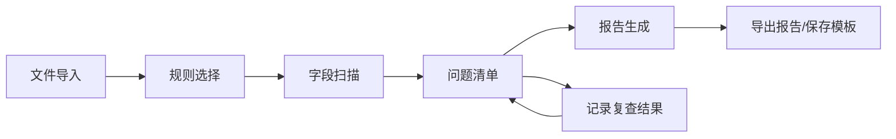

## 1. 产品概述
数据要素合规检查自动化工具，帮助数据运营人员在发布数据产品前进行合规自检。
- 核心目的：降低数据产品发布的合规风险，通过自动化扫描识别潜在问题，生成整改建议与合规报告
- 目标用户：数据运营人员、数据产品经理、数据合规审查人员
- 产品价值：提升合规检查效率 80%，标准化检查流程，减少人工疏漏

## 2. 核心功能

### 2.1 用户角色
| 角色 | 注册方式 | 核心权限 |
|------|----------|----------|
| 数据运营人员 | 本地工具，无需注册 | 文件导入、规则选择、执行扫描、查看问题、导出报告、管理模板 |

### 2.2 功能模块
1. **文件导入模块**：导入待发布说明文档（支持 TXT、Markdown、CSV、JSON 格式），展示文档内容预览
2. **规则选择模块**：选择行业规则（金融/医疗/电商/通用）和数据类型规则（个人信息/交易数据/行为数据/公开数据）
3. **字段扫描模块**：自动识别字段名称和样例值，标记疑似个人信息字段
4. **问题清单模块**：按严重程度排序展示所有问题，支持整改建议、记录复查结果、标记状态
5. **报告生成模块**：生成合规检查报告（含统计数据、问题列表、整改建议），支持导出 HTML/PDF 格式，保存常用检查模板

### 2.3 页面详情
| 页面名称 | 模块名称 | 功能描述 |
|-----------|-------------|---------------------|
| 主工作台 | 文件导入 | 拖拽/点击上传文件，预览解析内容，显示解析统计 |
| 主工作台 | 规则配置 | 行业规则多选、数据类型规则多选、自定义规则启用 |
| 主工作台 | 扫描执行 | 一键扫描按钮、扫描进度动画、扫描结果统计卡片 |
| 主工作台 | 问题清单 | 严重程度筛选、问题分类标签、字段级详情展开、复查状态切换、备注编辑 |
| 主工作台 | 报告面板 | 合规得分仪表盘、问题分类统计、报告预览、导出按钮、模板管理 |

## 3. 核心流程

用户上传待发布说明文档 → 选择适用的行业规则和数据类型规则 → 系统自动执行扫描（识别字段、检测个人信息、检查授权期限、用途范围、价格一致性等）→ 生成按严重程度排序的问题清单，附带整改建议 → 用户逐条复查并记录结果 → 生成并导出合规检查报告，可保存常用检查模板

## 4. 用户界面设计

### 4.1 设计风格
- **主色调**：深海蓝 `#1e3a5f` 搭配翡翠绿 `#10b981`（通过色）和琥珀橙 `#f59e0b`（警告色）和酒红 `#dc2626`（严重色）
- **辅助色**：石板灰系列作为中性色，营造专业稳重的合规审查氛围
- **按钮风格**：圆角 8px，带微妙阴影，hover 时上浮 1px 过渡动画
- **字体**：标题使用"思源黑体 SemiBold"，正文使用"思源黑体 Regular"，等宽数据展示使用"JetBrains Mono"
- **布局风格**：左侧面板导航 + 右侧主工作区的双栏布局，卡片式模块分区
- **图标风格**：Lucide 线性图标，统一 20px 尺寸

### 4.2 页面设计概述
| 页面名称 | 模块名称 | UI 元素 |
|-----------|-------------|-------------|
| 主工作台 | 顶部导航栏 | Logo + 工具标题 + 当前检查名称 + 操作按钮（新检查/历史记录） |
| 主工作台 | 文件导入区 | 虚线拖拽框 + 文件图标 + 上传提示文字 + 格式标签 |
| 主工作台 | 规则选择区 | 规则分类卡片组 + 复选开关 + 规则描述 Tooltip |
| 主工作台 | 扫描状态区 | 扫描进度条 + 状态徽章 + 5 项统计数据卡片（字段数/问题数/严重/警告/提示） |
| 主工作台 | 问题清单区 | 筛选标签栏 + 问题条目列表（严重度颜色条/标题/位置/整改建议/操作按钮） |
| 主工作台 | 报告预览区 | 环形合规得分图 + 问题分类柱状图 + 报告摘要卡片 + 导出操作栏 |

### 4.3 响应性
桌面端优先设计（1440px+），支持 1024px 平板自适应（侧边栏折叠），不考虑移动端。长列表区域使用内部滚动容器。

### 4.4 交互细节
- 文件拖拽悬停时边框变色 + 背景微亮
- 扫描执行时模块逐一高亮脉冲动画
- 问题条目展开时高度平滑过渡
- 严重程度标签使用渐变色背景 + 发光边框效果
- 报告生成完成时有轻微庆祝动效（粒子扩散）
