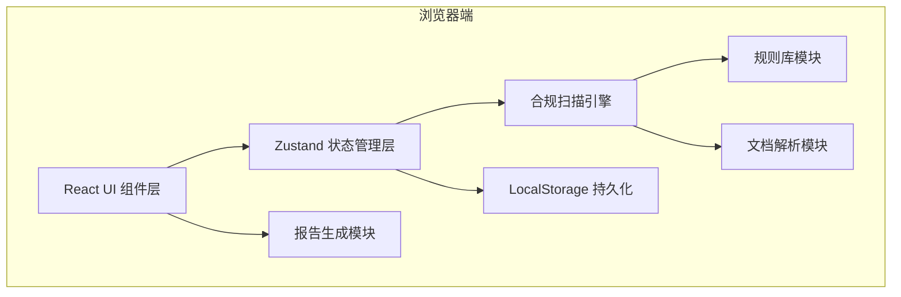

## 1. 架构设计

纯前端 SPA 应用，所有合规扫描逻辑在浏览器端本地执行，无需后端服务。使用 LocalStorage 持久化检查模板和历史记录。



## 2. 技术说明
- **前端**：React@18 + TypeScript + Vite + TailwindCSS@3 + Zustand + React Router
- **图标**：lucide-react
- **图表**：recharts（用于合规得分环形图和问题分类柱状图）
- **报告导出**：html2canvas + jspdf（PDF 导出）
- **初始化工具**：vite-init（react-ts 模板）
- **后端**：无（纯前端应用）
- **数据库**：LocalStorage（模板持久化）

## 3. 路由定义
| 路由 | 用途 |
|-------|---------|
| / | 合规检查主工作台（包含全部5个模块） |
| /templates | 检查模板管理页面 |
| /history | 历史检查记录页面 |

## 4. 核心数据模型

### 4.1 类型定义
```typescript
// 检查项严重程度
type SeverityLevel = 'critical' | 'warning' | 'info';

// 问题类型
type IssueCategory = 'personal_info' | 'auth_period' | 'usage_scope' | 'price_inconsistency' | 'update_frequency' | 'field_missing' | 'custom';

// 行业规则
type IndustryRule = 'finance' | 'healthcare' | 'ecommerce' | 'general';

// 数据类型规则
type DataTypeRule = 'personal' | 'transaction' | 'behavior' | 'public';

// 数据字段
interface DataField {
  id: string;
  name: string;
  sampleValue: string;
  isPersonalInfo: boolean;
  personalInfoType?: string;
  description?: string;
}

// 问题条目
interface ComplianceIssue {
  id: string;
  severity: SeverityLevel;
  category: IssueCategory;
  title: string;
  description: string;
  location?: string;
  fieldId?: string;
  suggestion: string;
  reviewed: boolean;
  reviewResult?: 'fixed' | 'accepted' | 'rejected';
  reviewNote?: string;
  createdAt: number;
}

// 检查模板
interface CheckTemplate {
  id: string;
  name: string;
  description: string;
  industryRules: IndustryRule[];
  dataTypeRules: DataTypeRule[];
  customRules: CustomRule[];
  createdAt: number;
  updatedAt: number;
}

// 检查会话
interface CheckSession {
  id: string;
  name: string;
  fileName?: string;
  fileContent?: string;
  industryRules: IndustryRule[];
  dataTypeRules: DataTypeRule[];
  fields: DataField[];
  issues: ComplianceIssue[];
  status: 'idle' | 'scanning' | 'completed';
  score: number;
  createdAt: number;
  completedAt?: number;
}
```

### 4.2 Store 状态结构
```
complianceStore:
  - currentSession: CheckSession
  - sessions: CheckSession[]
  - templates: CheckTemplate[]
  - scanProgress: number
  - actions:
    - uploadFile()
    - setRules()
    - runScan()
    - updateIssue()
    - exportReport()
    - saveTemplate()
    - loadTemplate()
```

## 5. 模块职责说明

### 5.1 文件导入模块
- 支持格式：.txt, .md, .csv, .json
- 使用 FileReader API 读取文件
- 针对 CSV/JSON 自动解析字段结构
- 针对 TXT/MD 使用正则提取字段定义（如表格、列表形式的字段说明）

### 5.2 规则引擎模块
- 预置行业规则（金融：账户/交易敏感字段检测；医疗：病历/健康信息检测；电商：收货/支付信息检测；通用：PII 通用识别）
- 预置数据类型规则（个人信息字段正则库、交易数据检查规则、行为数据规则、公开数据豁免规则）
- 自定义规则支持（正则表达式 + 严重程度配置）

### 5.3 扫描引擎模块
1. 字段识别阶段：解析文档，提取字段名、样例值、描述
2. 个人信息识别：基于关键词库 + 正则模式（手机号、身份证、邮箱、银行卡号、住址等）
3. 授权期限检查：查找"授权期"/"有效期"/"使用期限"相关描述，是否有明确到期日
4. 用途范围检查：查找"用途"/"使用场景"/"范围"，是否缺失或模糊
5. 价格一致性：检查全文出现的价格数值是否一致
6. 更新频率检查：检查"更新频率"字段与文档中其他描述是否一致

### 5.4 报告生成模块
- 计算合规得分（100 - 严重权重×3 - 警告权重×1）
- 使用 Recharts 绘制可视化图表
- HTML 报告：直接在浏览器中渲染打印友好页面
- PDF 导出：使用 html2canvas + jsPDF

## 6. 组件拆分
```
src/
├── components/
│   ├── layout/
│   │   ├── Header.tsx        # 顶部导航
│   │   └── Sidebar.tsx       # 侧边步骤导航
│   ├── modules/
│   │   ├── FileImport.tsx    # 文件导入模块
│   │   ├── RuleSelector.tsx  # 规则选择模块
│   │   ├── FieldScanner.tsx  # 字段扫描模块
│   │   ├── IssueList.tsx     # 问题清单模块
│   │   └── ReportGenerator.tsx# 报告生成模块
│   ├── common/
│   │   ├── SeverityBadge.tsx # 严重程度徽章
│   │   ├── ProgressBar.tsx   # 进度条
│   │   ├── StatCard.tsx      # 统计卡片
│   │   └── EmptyState.tsx    # 空状态
│   └── charts/
│       ├── ScoreGauge.tsx    # 得分仪表盘
│       └── CategoryChart.tsx # 问题分类柱状图
├── store/
│   └── complianceStore.ts    # Zustand 状态管理
├── utils/
│   ├── parser.ts             # 文档解析工具
│   ├── scanner.ts            # 合规扫描引擎
│   ├── piiDetector.ts        # 个人信息检测
│   ├── reportExporter.ts     # 报告导出工具
│   └── rules.ts              # 规则库
├── types/
│   └── index.ts              # 全局类型定义
├── data/
│   └── mockData.ts           # 演示用 Mock 数据
├── pages/
│   ├── Workbench.tsx         # 主工作台页面
│   ├── Templates.tsx         # 模板管理页面
│   └── History.tsx           # 历史记录页面
└── App.tsx                   # 应用入口
```
